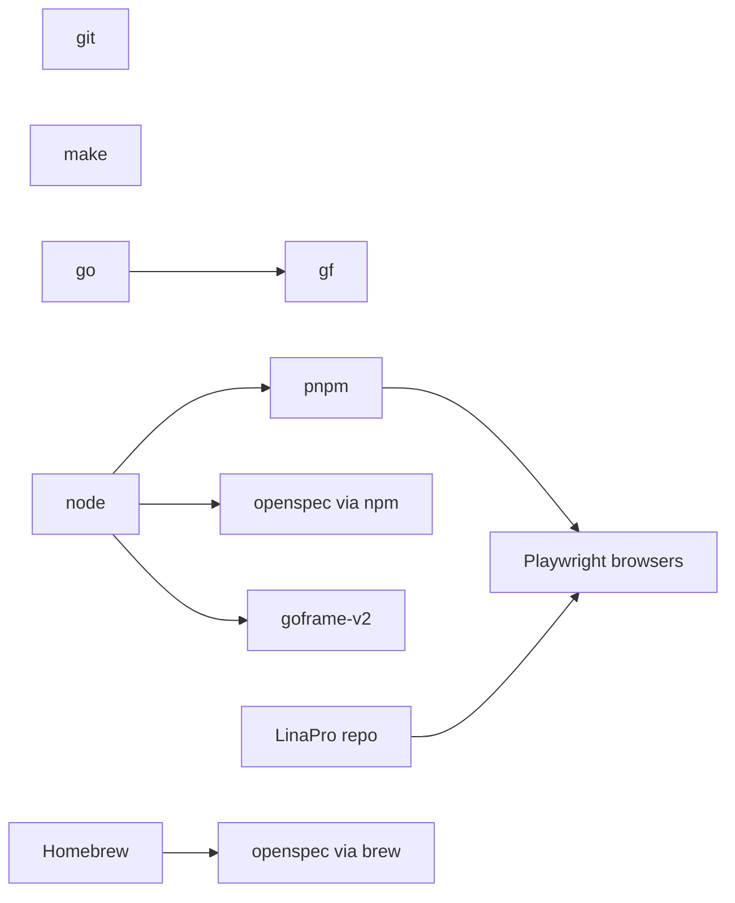

# Lina Doctor 安装策略

## 公共函数迁移清单

`lina-doctor` 从原 `hack/scripts/install/lib/_common.sh` 仅迁移与环境诊断/安装编排通用的纯工具函数。

| 原函数 | 处理方式 | 原因 |
| --- | --- | --- |
| `log_info` / `log_warn` / `log_error` / `log_debug` / `die` | 迁移并改为 `[lina-doctor]` 前缀 | 所有 doctor 脚本都需要统一日志与失败出口 |
| `_semver_core` / `version_ge` | 迁移 | `go` / `node` / `pnpm` 版本下限比较需要复用 |
| `confirm` | 迁移并改用 `LINAPRO_DOCTOR_NON_INTERACTIVE` | doctor 安装步骤需要逐项确认 |
| `retry` | 迁移 | 网络安装命令需要固定延迟重试能力 |
| `detect_os` | 迁移 | doctor-detect 平台探测需要复用 |
| `is_port_in_use` | 不迁移 | doctor 不负责端口探测,端口占用不属于工具链安装前置条件 |
| `require_command` | 不迁移 | doctor 需要结构化 JSON 诊断,不能直接 `die` |
| `run_prereq_check` / `run_standard_install` | 不迁移 | install 专属流程已从 bootstrap 链路移除 |
| `download_go_modules` / `install_frontend_deps` | 不迁移 | doctor 不负责项目依赖预下载 |
| `copy_default_config` | 不迁移 | doctor 不负责项目初始化或配置写入 |
| `run_make_or_fallback` / `run_core_fallback` | 不迁移 | doctor 不执行 `make init` / `make mock` |

后续完整安装策略、拓扑顺序、包管理器优先级和 Windows PowerShell wrapper 将继续在本文档中补齐。

## 拓扑顺序



规则：

- `gf`必须在 Go 满足后安装。
- `pnpm`、`goframe-v2`和 npm 通道的`openspec`必须在 Node 满足后安装。
- `Playwright browsers`必须在 pnpm 满足且仓库根目录存在后安装。
- macOS 的`brew install openspec`是主通道；如果失败，再回落到`npm i -g @fission-ai/openspec@latest`。

## 包管理器优先级

| 平台 | 优先级 |
| --- | --- |
| `macOS` | `brew` |
| `Linux` / `WSL` | `apt-get` > `dnf` > `yum` > `pacman` |
| `Windows Git Bash` | `winget` > `scoop` > `choco` |

WSL 默认安装到 Linux 环境。只有用户明确要求 Windows 主机工具链时，才使用 PowerShell 包装的 Windows 包管理器。

## Node 版本管理器

如果检测到`nvm`、`fnm`或`volta`，Node 安装命令改为对应版本管理器：

| 工具 | 命令 |
| --- | --- |
| `nvm` | `nvm install 20 && nvm use 20` |
| `fnm` | `fnm install 20 && fnm use 20` |
| `volta` | `volta install node@20` |

上述命令安装最新 Node 20.x，必须满足`20.19.0`下限。

## Windows PowerShell 包装

Windows Git Bash 中调用 Windows 包管理器时统一使用：

```bash
powershell.exe -NoProfile -Command "<package-manager command>"
```

不要直接从 Git Bash 调用`winget`、`scoop`或`choco`，避免参数转义、stdin 和编码行为不一致。

## 超时与重试

- 单步安装默认超时为`300s`，通过`LINAPRO_DOCTOR_TIMEOUT`覆盖。
- 安装命令输出写入`/tmp/lina-doctor-<tool>.log`。
- 关键工具失败立即停止。
- `Playwright browsers`和`goframe-v2`失败时输出非阻塞 escalation，并继续后续步骤。
