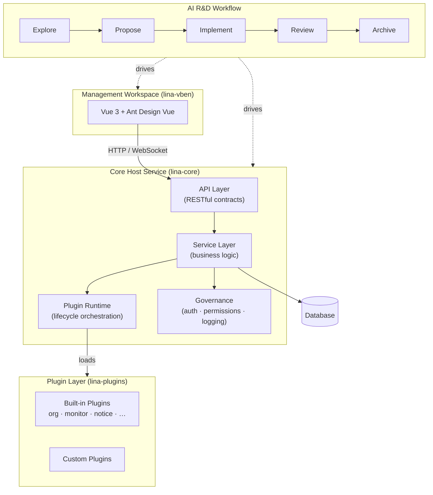

# LinaPro

LinaPro is an **AI-driven full-stack development framework** built for engineering teams that want every line of AI-generated code to be trustworthy, verifiable, and sustainably evolvable — not just faster to produce. Its core principle is **AI as the primary driver, humans as the guide**: AI handles the bulk of analysis, design, and implementation execution, while humans define direction, own critical decisions, and ensure quality at key review gates.

The framework combines four tightly interlocking layers: a universal core host service, a production-ready management workspace, a dual-mode plugin runtime for unlimited extensibility, and a specification-driven AI-native R&D workflow. Each layer is designed independently under a strict loose-coupling principle. Business modules can be enabled or disabled on demand, ensuring that delivery quality does not degrade as the product scales.

## The Challenge: Why AI-Driven Projects Stall at Scale

AI coding assistants often deliver stunning early gains — a few pages, a handful of endpoints, shipped in minutes. But as the product keeps evolving, that efficiency quietly reverses:

- **Context collapse**: requirement changes outpace what an AI session can hold in context, forcing constant re-alignment and repeatedly overturning past decisions.
- **Architectural drift**: without a shared specification baseline, each AI-generated chunk subtly contradicts the last, and technical debt accumulates invisibly.
- **Test void**: acceptance criteria live in conversation history rather than executable tests, so regressions go undetected until they surface in production.
- **Review bottleneck**: as the codebase grows, the human effort needed to audit AI output scales linearly and eventually dominates the delivery timeline.
- **Diminishing returns**: the overhead of governing AI output ends up exceeding the productivity it originally delivered.

The root cause is not AI capability — it is the absence of a **battle-tested, production-grade framework purpose-built for human-AI collaboration**. AI-era software development still needs a framework, and especially a mature one that has been hardened through real-world delivery. Not just to help product architecture take shape quickly, but more importantly to provide structural support for an **AI-led, human-guided** collaboration model — ensuring that this collaboration grows more efficient with every product iteration rather than decaying under its own weight. That is the founding principle behind LinaPro.

## What is LinaPro

LinaPro provides four interlocking layers:

| Layer | Module | Description |
|-------|--------|-------------|
| Core Host Service | `apps/lina-core` | Universal backend runtime — API contracts, service governance, authentication, permissions, plugin lifecycle |
| Management Workspace | `apps/lina-vben` | Production-ready frontend workspace built on Vue 3 — the reference UI for all built-in capabilities |
| Plugin System | `apps/lina-plugins` | Hot-loadable plugins (source and dynamic) that extend or override any core capability without touching the host |
| AI R&D Workflow | `openspec/` | A structured specification-first workflow that keeps AI, humans, and codebase aligned through every iteration |

### Key Strengths

**Specification-driven AI-native R&D workflow.** Every iteration follows a closed-loop pipeline — Explore → Propose → Implement → Review → Archive — anchored to incremental specification files and mandatory E2E tests. AI always builds on a verified foundation, fundamentally preventing architectural drift and test voids.

**Integrated full-stack design.** The framework ships both a production-ready backend runtime (`lina-core`) and a frontend management workspace (`lina-vben`), fully aligned on API contracts, permission models, and design conventions. Teams deliver complete products without manually integrating two separate frameworks.

**Production-ready built-in capabilities.** Built-in core services covering a full range of business scenarios, multiple production-ready official plugins, and a rich set of management feature modules — so teams can focus on business development from day one without building infrastructure from scratch.

**Module-level loose coupling.** Every business module is designed independently under a strict loose-coupling principle, collaborating through interfaces rather than hard dependencies. Modules are composable and replaceable, and can be enabled or disabled on demand.

**Unmatched extensibility.** A dual-mode pluggable plugin runtime — compile-time source plugins and runtime WASM dynamic plugins — runs plugins in isolated sandboxes with namespaced database and filesystem access. A unified extension point system covers the full core lifecycle; any capability can be extended or replaced through a plugin without touching host code.

**Enterprise-grade governance out of the box.** JWT authentication with a declarative RBAC permission system — permissions are declared as API-layer struct tags, making the permission model visible and auditable by design. Permission topology propagates in milliseconds; operation logs auto-mask sensitive fields; session management supports force-logout; login audit captures full IP and device fingerprints.

**Distribution-ready architecture.** The framework is designed for distributed deployment from the ground up — permission topology synchronization, distributed locking, and key-value caching are all cluster-aware. It scales seamlessly from single-node to multi-node cluster with native horizontal scalability and no architectural changes required.

## Built-in Management Workspace

LinaPro ships a fully featured default management workspace (`lina-vben`) covering the most common foundational business scenarios in enterprise application development. Teams can build directly on top of it, extend any module via the plugin system, or replace individual modules entirely — all without touching the core host.

**Access Control**

| Module | Description |
|--------|-------------|
| User Management | Full CRUD, role assignment, password reset, status control, batch export |
| Role Management | Role definition, menu permission assignment, button-level authorization |
| Menu Management | Dynamic menu tree configuration supporting directory / menu / button three-level structure |

**System Settings**

| Module | Description |
|--------|-------------|
| Data Dictionary | Centralized dictionary type and data maintenance with import/export |
| Parameter Settings | Runtime parameter maintenance with configuration import/export |
| File Management | File upload, download, and storage management |

**Job Scheduling**

| Module | Description |
|--------|-------------|
| Job Management | Cron expression configuration, immediate execution, pause/resume, execution history |
| Group Management | Job grouping by business domain |
| Execution Logs | Execution record queries and exception log inspection |

**Extension Center**

| Module | Description |
|--------|-------------|
| Plugin Management | Plugin install, enable, disable, uninstall, and version management |

**Developer Center**

| Module | Description |
|--------|-------------|
| API Docs | Online API documentation browsing and debugging |
| System Info | Runtime environment information |

The following modules are provided by official plugins. Installing the corresponding plugin automatically injects the menu entries and routes — no additional configuration required:

| Plugin | Menu Modules | Description |
|--------|-------------|-------------|
| `org-center` | Department Management, Position Management | Organization tree maintenance and position definitions |
| `content-notice` | Notice Management | Announcement CRUD supporting multiple notice types |
| `monitor-online` | Online Users | Real-time online session visibility with force-logout capability |
| `monitor-server` | Server Monitor | CPU, memory, disk, and runtime information collection and display |
| `monitor-operlog` | Operation Logs | User operation audit with request parameters, duration, and outcome |
| `monitor-loginlog` | Login Logs | Login record queries with IP address, device information, and result |

All modules are fully integrated with the backend RBAC permission system — role assignments control menu visibility and button-level operation permissions, and permission changes take effect in real time without requiring re-login.

## Architecture

The following diagram shows how the four layers interact at runtime:



**Design principles reflected in the diagram:**

- The `AI R&D Workflow` sits above everything — it is the connective tissue that keeps specifications, code, and tests synchronized.
- `lina-core` is the stable foundation; it knows nothing about specific UI layouts or business domains.
- Plugins are isolated units that extend `lina-core` through well-defined interfaces, never by modifying host internals.
- The management workspace is one consumer of `lina-core`, not its definition.

## Repository Layout

```text
apps/
  lina-core/      Core host service (Go)
  lina-vben/      Default management workspace (Vue 3 + Vben 5)
  lina-plugins/   Built-in and sample plugins
hack/
  tests/          Playwright E2E test suite
openspec/
  changes/        Active and archived change records
  specs/          Current baseline capability specifications
```

## Getting Started

### Prerequisites

- Go 1.21+
- Node.js 18+
- pnpm 9+
- MySQL 8.0+

### Quick Start

```bash
# 1. Initialise the database
make init

# 2. Load demo data (optional)
make mock

# 3. Start backend and frontend
make dev
```

The management workspace is available at `http://localhost:5666`.
The backend API is available at `http://localhost:8080`.

### Other Useful Commands

```bash
make stop         # Stop all local services
make status       # Show service status
make test         # Run the full E2E suite
```

## Default Account

| Field | Value |
|-------|-------|
| Username | `admin` |
| Password | `admin123` |

## Plugin Development

Plugins are the primary extension point in LinaPro. A plugin is a self-contained package that declares its own API routes, service logic, database schema, frontend pages, and menu entries. The host loads and unloads plugins at runtime with zero downtime.

See `apps/lina-plugins/README.md` for a step-by-step guide to building and registering a plugin.

## Documentation and Entry Points

| Resource | Description |
|----------|-------------|
| `CLAUDE.md` | Repository-wide engineering rules, coding standards, and workflow guidance |
| `apps/lina-core/README.md` | Core host service architecture and extension contracts |
| `apps/lina-vben/README.md` | Frontend workspace setup and development guide |
| `apps/lina-plugins/README.md` | Plugin system overview and development reference |
| `openspec/specs/` | Current baseline capability specifications |
