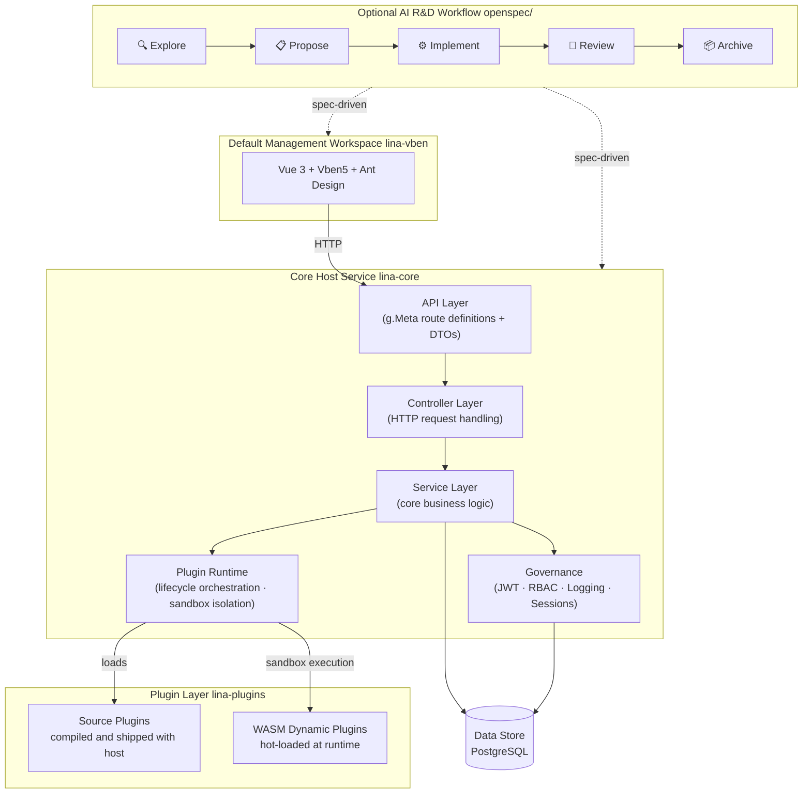

<div align="center">


[](https://github.com/linaproai/linapro/actions/workflows/main-ci.yml)
[](https://github.com/linaproai/linapro/releases)
[](https://github.com/linaproai/linapro)
[](https://github.com/linaproai/linapro)


English | [简体中文](README.zh-CN.md)

</div>

# Overview

`LinaPro` is an **AI-native full-stack framework engineered for sustainable delivery**.

It unifies a specification-driven AI R&D workflow, a comprehensive AI skill system spanning the full development lifecycle, a complete plugin runtime, and an integrated full-stack design — with enterprise-grade capabilities like access control, system configuration, and job scheduling built right in.

Teams skip the infrastructure bootstrapping phase and put AI to work on real business development from day one.


# Quick Links

| Resource | URL |
|----------|-----|
| **Repository** | https://github.com/linaproai/linapro |
| **Live Demo** | http://demo.linapro.ai/ <br/>Username: `admin` <br/>Password: `admin123` |
| **Website** | https://linapro.ai/ |

# Who It's For

`LinaPro` is designed for individual developers, engineering teams, and enterprises that need:

- **AI-native R&D workflow**: `OpenSpec` is an optional but recommended dependency for specification-driven delivery. `LinaPro` provides first-class conventions, prompts, skills, and repository structure for it, so AI can lead analysis, design, and implementation while your team stays focused on direction rather than execution details.
- **A rich AI skill ecosystem**: Over a dozen built-in AI skills cover the entire development lifecycle — backend development, frontend design, test writing, code review, performance auditing, and more. These skills are embedded directly in the framework's AI collaboration conventions, so AI automatically applies the right expertise in each context without requiring you to re-explain project rules in every session.
- **Fast business development**: A batteries-included management workspace and a rich set of built-in modules dramatically shorten the path from zero to production.
- **Integrated full-stack design**: Frontend and backend are designed as a unified whole — API contracts, permission models, and design conventions are fully aligned, so there's no manual integration overhead.
- **Complete API documentation**: All host and plugin API endpoints are automatically aggregated into a single browsable and debuggable doc site.
- **Extensible plugin ecosystem**: A dual-mode plugin system (source plugins + `WASM` dynamic plugins) lets any capability be extended or replaced via a plugin.
- **Enterprise-grade governance**: JWT authentication with a declarative RBAC permission system, plus built-in operation logs, login logs, and session management for comprehensive auditability.
- **Distribution-ready by design**: Built-in distributed locking, key-value caching, and horizontal scaling — no architectural changes needed as your system grows.

# Architecture



# Core Features

## AI-Native R&D Workflow

`LinaPro` has first-class support for `OpenSpec`, an optional but recommended specification-driven workflow that closes the loop from requirement to delivery:

- Projects can run without `OpenSpec`; adopting it enables a five-stage cycle — Explore → Propose → Implement → Review → Archive
- Changes can be anchored to incremental specification files and matching automated tests, preventing architectural drift and coverage gaps without making `OpenSpec` a runtime requirement
- AI can build forward from a verified foundation rather than generating code in a vacuum
- Developers own direction and key decisions; AI handles analysis, design, implementation, and testing within the constraints of the established specs

## A Rich AI Skill Ecosystem

`LinaPro` ships with over a dozen built-in AI skills covering the full development lifecycle — backend development, frontend design, test assurance, code review, performance auditing, and more. These skills are embedded as domain knowledge directly in the framework's AI collaboration conventions. No separate installation is needed; AI tooling activates the relevant skill automatically when working in each context, ensuring that AI makes framework-aware decisions at every step without requiring repeated re-explanation of project rules in each session.

## Decoupled Host and Workspace

- The core host service (`lina-core`) is a pure backend runtime, completely decoupled from any frontend implementation
- The default management workspace (`lina-vben`) is a reference UI implementation of the host's capabilities — it can be swapped out for any frontend, including mobile apps, mini-programs, or a custom admin system
- The host exposes all capabilities through stable `RESTful API` contracts that are entirely frontend-agnostic
- Multiple frontends can connect to the same host simultaneously to serve different interface requirements

## Core Host Service

`lina-core` is the stable foundation of the entire framework, built on `GoFrame`:

- **API contract layer**: A complete `RESTful API` interface covering system management, plugin governance, and shared platform capabilities
- **Service layer**: Unified implementations of auth, permissions, users, roles, menus, dictionaries, configuration, file management, and other core services
- **Plugin runtime**: Loads source plugins and `WASM` dynamic plugins, orchestrates their full lifecycle, and exposes stable extension seams
- **Governance**: Built-in JWT authentication, declarative RBAC permissions, operation auditing, and session management
- **Job scheduling**: A built-in `Cron` subsystem supporting job groups, execution history, and exception tracking
- **Infrastructure**: Distributed locking, key-value caching, i18n internationalization, database migrations, and other foundational capabilities

## Dual-Mode Plugin System

Plugins are the primary extension point in `LinaPro`. Each plugin is a self-contained module package:

- **Source plugins**: Compiled and packaged with the host at build time — ideal for core business modules maintained long-term, with zero runtime overhead
- **`WASM` dynamic plugins**: Hot-loaded at runtime with full online install, enable, disable, and uninstall support — no host restarts required
- Plugins run in isolated sandboxes with namespaced database and filesystem access, so plugins cannot interfere with each other
- Each plugin independently declares its own API routes, business logic, database schema, frontend pages, and menu entries — fully self-contained with zero host intrusion

## Official Plugin Workspace

The official source plugins live in a separate repository and are mounted into this host at `apps/lina-plugins` from `https://github.com/linaproai/official-plugins.git`.

- Initialize it after cloning with `git submodule update --init --recursive`
- Host-only commands work without the submodule
- `make dev`, `make build`, `make image`, and `make image.build` auto-enable plugin-full mode when `apps/lina-plugins` contains plugin manifests; pass `plugins=0` to force host-only mode
- Plugin-full mode generates or refreshes the ignored `temp/go.work.plugins` workspace from the host-only root `go.work`, then uses it via `GOWORK`
- Plugin-only tests and plugin E2E require the submodule to be initialized

User projects that want to maintain plugins directly in their own repository should convert `apps/lina-plugins` into a normal directory instead of keeping the official submodule. Configure plugin sources in `hack/config.yaml` under `plugins.sources`, then use:

- `make plugins.init` to detach `apps/lina-plugins` from submodule metadata while preserving existing plugin code
- `make plugins.install` to install configured plugins into `apps/lina-plugins/<plugin-id>`
- `make plugins.update` to update configured plugins, with local changes blocked unless `force=1` is passed
- `make plugins.status` to inspect workspace type, plugin versions, local changes, lock state, and remote update status

## Enterprise-Grade Security

- JWT authentication paired with a declarative RBAC permission system — permissions are declared as struct tags in the API definition layer, making the permission model inherently visible and auditable
- Permission granularity down to the button level, with three-tier control covering menus, pages, and operations
- Permission topology changes propagate immediately on single-node deployments and within three seconds across a cluster — no service restarts needed
- Session management supports force-logout
- Login logs capture complete IP addresses, device information, and login results

## Default Management Workspace

`lina-vben` is the framework's fully featured built-in management workspace. Teams can build business applications directly on top of it:


## Native Distributed Architecture

- Supports both single-node and distributed cluster deployments — horizontal scaling requires zero changes to business code
- Built-in distributed locking and key-value caching, with core components that are natively cluster-aware
- The job scheduling subsystem is distribution-aware, automatically preventing duplicate execution across cluster nodes
- Single-node mode does not require `Redis`; when `cluster.enabled=true`, the host requires `cluster.coordination: redis` and a reachable `cluster.redis` endpoint before it starts. The current coordination backend is `Redis`, with the configuration shape intentionally kept open for future backends.
- Optional Redis integration tests are disabled by default. Set `LINA_TEST_REDIS_ADDR`, for example `LINA_TEST_REDIS_ADDR=127.0.0.1:6379`, to enable tests that require a real Redis instance.

## Multi-Tenant Foundation

`LinaPro` is being extended with a pool-based multi-tenant model that keeps the single-tenant experience available by default. When the `multi-tenant` plugin is not installed or enabled, host and plugin data use `tenant_id = 0`, which represents the `PLATFORM` tenant.

When the `multi-tenant` plugin is enabled:

- Tenant identity is resolved by the built-in chain: `override`, `jwt`, `session`, `header`, `subdomain`, and `default`; supported runtime policy changes are stored by the plugin, not by the host config template.
- The isolation model is code-owned and currently fixed to `pool`.
- User-to-tenant cardinality is code-owned and defaults to `multi`, allowing one user to belong to multiple tenants.
- Plugins declare `scope_nature`, `supports_multi_tenant`, and `default_install_mode` in `plugin.yaml`; new-tenant auto-enable policy is managed by the platform registry, not by the manifest.
- `platform_only` plugins are governed globally, while `tenant_aware` plugins can be enabled globally or per tenant.
- LifecycleGuard hooks may veto plugin disable or uninstall operations, and `plugin.allowForceUninstall` controls whether platform administrators can force an audited override.

Typical internal `BU` usage starts with the built-in `multi` cardinality, `prompt` ambiguity handling, and tenant-scoped enablement for audit or content plugins. This iteration uses the pool model only; `rootDomain` is reserved for a later settings release and is not configurable yet. Schema-per-tenant, database-per-tenant, quotas, billing, and branding customization are reserved for future work.


# Tech Stack

| Category | Technology | Notes |
|----------|------------|-------|
| Backend Language | `Go` | `v1.25.0` |
| Backend Framework | `GoFrame` | `v2.10.1` — routing, ORM, configuration, and more |
| Frontend Framework | `Vue 3` | Built on the `Vben 5` admin template |
| Frontend UI | `Ant Design Vue` | Enterprise-grade UI component library |
| Build Tool | `Vite` | Lightning-fast frontend builds |
| Database | `PostgreSQL` / optional `SQLite` | `PostgreSQL 14+` is the default data store. `SQLite` can be used for local demo or smoke testing; it is single-node only and not for production. |
| Plugin Runtime | `WebAssembly` | `tetratelabs/wazero`, powering WASM dynamic plugins |

## Quick Start

`LinaPro` uses `PostgreSQL` as the default database. Prepare a `PostgreSQL 14+` instance before running `make init` or `make dev`; those commands do not start or manage the database.

For local development, start a matching container:

```bash
docker run --name linapro-postgres \
  -e POSTGRES_USER=postgres \
  -e POSTGRES_PASSWORD=postgres \
  -e POSTGRES_DB=linapro \
  -p 5432:5432 \
  --health-cmd pg_isready \
  --health-interval 10s \
  --health-timeout 5s \
  --health-retries 5 \
  -d postgres:14-alpine
```

If local port `5432` is already occupied, map the container to another host port
such as `15432:5432` and update `database.default.link` to use that host port.

Install frontend dependencies once, then initialize and run the project:

```bash
corepack enable
cd apps/lina-vben
pnpm install
cd ../..
cd hack/tools/linactl
go run . init confirm=init
go run . mock confirm=mock
go run . dev
```

Linux and macOS users can keep using the compatibility `Makefile` entrypoint:

```bash
make init confirm=init
make mock confirm=mock
make dev
```

Windows users can use the cross-platform Go entrypoint above. The repository also provides a thin `make.cmd` wrapper for `cmd.exe`; because `cmd.exe` resolves executable file extensions in the current directory, the `.cmd` suffix can be omitted and the command can be written as `make`:

```cmd
make init confirm=init
make mock confirm=mock
make dev
```

In PowerShell, call the wrapper with the current-directory prefix. On default Windows environments, the `.cmd` suffix can also be omitted as `.\make`. Use `.\make.cmd` when you want to avoid ambiguity with another installed `make` command:

```powershell
.\make init confirm=init
.\make mock confirm=mock
.\make dev
```

The default backend link is:

```yaml
database:
  default:
    link: "pgsql:postgres:postgres@tcp(127.0.0.1:5432)/linapro?sslmode=disable"
```

`linactl init` and `make init` are operations bootstrap commands. They use the configured database account and require permission to connect to the system database, create and drop the target database, terminate target-database connections, create tables and indexes, write comments, and insert seed data. If those permissions are missing, initialization fails instead of falling back to a lower-privilege runtime mode.

For external hosted `PostgreSQL`, such as `RDS` or `Aliyun PolarDB`, point `database.default.link` at the provider host and port. Use an initialization account with the permissions above for `linactl init` or `make init`, then run the service with the same configured database unless your deployment process replaces the config with a runtime account after initialization.

For a single-node development demo, switch the link to `SQLite`:

```yaml
database:
  default:
    link: "sqlite::@file(./temp/sqlite/linapro.db)"
```

`SQLite` mode is for local demo and smoke testing only. It is not a production deployment mode.
