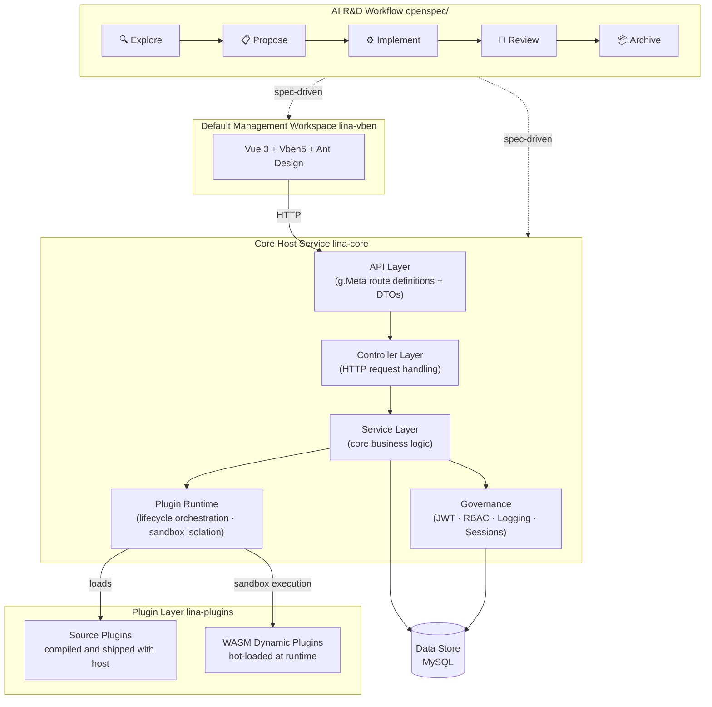

English | [简体中文](README.zh-CN.md)

# Overview

`LinaPro` is an **AI-native full-stack framework engineered for sustainable delivery**.

It unifies a specification-driven AI R&D workflow, a comprehensive AI skill system spanning the full development lifecycle, a complete plugin runtime, and an integrated full-stack design — with enterprise-grade capabilities like access control, system configuration, and job scheduling built right in.

Teams skip the infrastructure bootstrapping phase and put AI to work on real business development from day one.

# Quick Links

| Resource | URL |
|----------|-----|
| **Repository** | https://github.com/linaproai/linapro |
| **Live Demo** | http://demo.linapro.ai/  Username: `admin`  Password: `admin123` |
| **Website** | https://linapro.ai/ |

# Who It's For

`LinaPro` is designed for individual developers, engineering teams, and enterprises that need:

- **AI-native R&D workflow**: The built-in `OpenSpec` specification-driven workflow puts AI in charge of analysis, design, and implementation. Every change is anchored to incremental specs and mandatory E2E tests, so your team stays focused on direction rather than execution details.
- **A rich AI skill ecosystem**: Over a dozen built-in AI skills cover the entire development lifecycle — backend development, frontend design, test writing, code review, performance auditing, version upgrades, and more. These skills are embedded directly in the framework's AI collaboration conventions, so AI automatically applies the right expertise in each context without requiring you to re-explain project rules in every session.
- **Fast business development**: A batteries-included management workspace and a rich set of built-in modules dramatically shorten the path from zero to production.
- **Integrated full-stack design**: Frontend and backend are designed as a unified whole — API contracts, permission models, and design conventions are fully aligned, so there's no manual integration overhead.
- **Complete API documentation**: All host and plugin API endpoints are automatically aggregated into a single browsable and debuggable doc site.
- **Extensible plugin ecosystem**: A dual-mode plugin system (source plugins + `WASM` dynamic plugins) lets any capability be extended or replaced via a plugin.
- **Enterprise-grade governance**: JWT authentication with a declarative RBAC permission system, plus built-in operation logs, login logs, and session management for comprehensive auditability.
- **Distribution-ready by design**: Built-in distributed locking, key-value caching, and horizontal scaling — no architectural changes needed as your system grows.

# Architecture

# Core Features

## AI-Native R&D Workflow

`LinaPro` ships with `OpenSpec`, a specification-driven workflow that closes the loop from requirement to delivery:

- Every iteration moves through a five-stage cycle — Explore → Propose → Implement → Review → Archive
- Each change is anchored to incremental specification files and mandatory E2E tests, preventing architectural drift and coverage gaps
- AI always builds forward from a verified foundation rather than generating code in a vacuum
- Developers own direction and key decisions; AI handles analysis, design, implementation, and testing within the constraints of the established specs

## A Rich AI Skill Ecosystem

`LinaPro` ships with over a dozen built-in AI skills covering the full development lifecycle — backend development, frontend design, test assurance, code review, performance auditing, version management, and more. These skills are embedded as domain knowledge directly in the framework's AI collaboration conventions. No separate installation is needed; AI tooling activates the relevant skill automatically when working in each context, ensuring that AI makes framework-aware decisions at every step without requiring repeated re-explanation of project rules in each session.

## Decoupled Host and Workspace

- The core host service (`lina-core`) is a pure backend runtime, completely decoupled from any frontend implementation
- The default management workspace (`lina-vben`) is a reference UI implementation of the host's capabilities — it can be swapped out for any frontend, including mobile apps, mini-programs, or a custom admin system
- The host exposes all capabilities through stable `RESTful API` contracts that are entirely frontend-agnostic
- Multiple frontends can connect to the same host simultaneously to serve different interface requirements

## Core Host Service

`lina-core` is the stable foundation of the entire framework, built on `GoFrame`:

- **API contract layer**: A complete `RESTful API` interface covering system management, plugin governance, and shared platform capabilities
- **Service layer**: Unified implementations of auth, permissions, users, roles, menus, dictionaries, configuration, file management, and other core services
- **Plugin runtime**: Loads source plugins and `WASM` dynamic plugins, orchestrates their full lifecycle, and exposes stable extension seams
- **Governance**: Built-in JWT authentication, declarative RBAC permissions, operation auditing, and session management
- **Job scheduling**: A built-in `Cron` subsystem supporting job groups, execution history, and exception tracking
- **Infrastructure**: Distributed locking, key-value caching, i18n internationalization, database migrations, and other foundational capabilities

## Dual-Mode Plugin System

Plugins are the primary extension point in `LinaPro`. Each plugin is a self-contained module package:

- **Source plugins**: Compiled and packaged with the host at build time — ideal for core business modules maintained long-term, with zero runtime overhead
- **`WASM` dynamic plugins**: Hot-loaded at runtime with full online install, enable, disable, and uninstall support — no host restarts required
- Plugins run in isolated sandboxes with namespaced database and filesystem access, so plugins cannot interfere with each other
- Each plugin independently declares its own API routes, business logic, database schema, frontend pages, and menu entries — fully self-contained with zero host intrusion

## Enterprise-Grade Security

- JWT authentication paired with a declarative RBAC permission system — permissions are declared as struct tags in the API definition layer, making the permission model inherently visible and auditable
- Permission granularity down to the button level, with three-tier control covering menus, pages, and operations
- Permission topology changes propagate immediately on single-node deployments and within three seconds across a cluster — no service restarts needed
- Session management supports force-logout
- Login logs capture complete IP addresses, device information, and login results

## Default Management Workspace

`lina-vben` is the framework's fully featured built-in management workspace. Teams can build business applications directly on top of it:

## Native Distributed Architecture

- Supports both single-node and distributed cluster deployments — horizontal scaling requires zero changes to business code
- Built-in distributed locking and key-value caching, with core components that are natively cluster-aware
- The job scheduling subsystem is distribution-aware, automatically preventing duplicate execution across cluster nodes

# Tech Stack

| Category | Technology | Notes |
|----------|------------|-------|
| Backend Language | `Go` | `v1.25.0` |
| Backend Framework | `GoFrame` | `v2.10.1` — routing, ORM, configuration, and more |
| Frontend Framework | `Vue 3` | Built on the `Vben 5` admin template |
| Frontend UI | `Ant Design Vue` | Enterprise-grade UI component library |
| Build Tool | `Vite` | Lightning-fast frontend builds |
| Database | `MySQL` / optional `SQLite` | `MySQL 8.0+` is the primary data store. `SQLite` can be used for demo or local test mode without MySQL; it is single-node only and not for production. |
| Plugin Runtime | `WebAssembly` | `tetratelabs/wazero`, powering WASM dynamic plugins |

