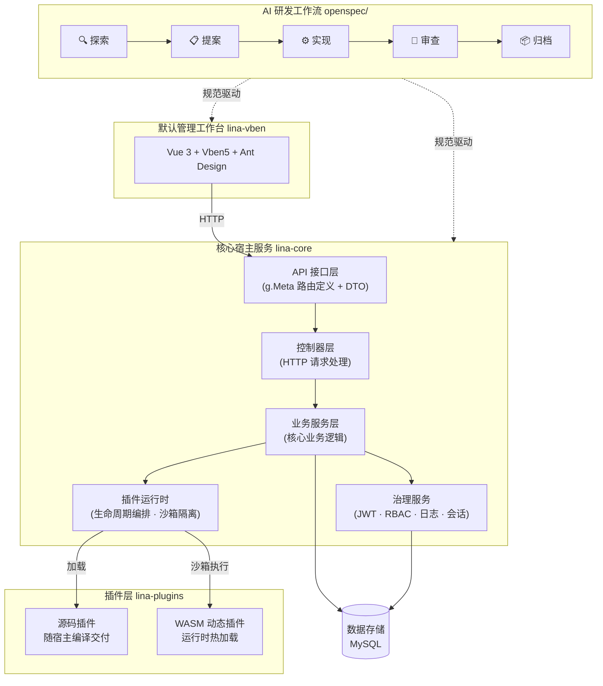

**[English](README.md) | 简体中文**

# 项目介绍

`LinaPro`是一款**面向可持续交付的`AI`原生全栈框架**，将规范驱动的`AI`研发工作流、全生命周期`AI`技能体系、完整插件运行时与前后端一体化全栈设计融为一体，并内置权限管理、系统配置、任务调度等企业级基础能力，为团队构建起一套完整的`AI`原生交付底座。团队无需从零搭建基础设施，从第一天起就能以`AI`作为主力驱动业务开发和持续交付。

# 快速链接

| 资源 | 地址 |
|------|------|
| 开源仓库 | https://github.com/linaproai/linapro |
| 后台演示 | http://demo.linapro.ai/  账号：`admin`  密码：`admin123`|
| 官方网站 | https://linapro.ai/ |

# 项目定位

`LinaPro`面向独立开发者、研发团队和企业，提供以下核心能力：

- **AI 原生研发工作流**：内置`OpenSpec`规范驱动工作流，让`AI`主导分析、设计与实现，每次变更均锚定在增量规范与强制`E2E`测试上，团队专注于方向决策
- **丰富的 AI 技能体系**：内置十余项覆盖研发全生命周期的专属`AI`技能，涵盖后端开发、前端设计、测试编写、代码审查、性能审计、版本升级等场景，让`AI`在每个具体工作环节都能做出符合框架约束的专业决策
- **快速业务开发**：开箱即用的管理工作台与丰富的内置模块，显著缩短项目从零到上线的时间
- **全栈一体化**：前后端统一设计，接口契约、权限模型与设计规范完全对齐，无需独立集成两套框架
- **完整 API 文档**：自动聚合宿主与所有插件接口，支持在线浏览与调试
- **插件生态**：双模式插件系统（源码插件 +`WASM`动态插件），任意能力均可通过插件扩展或替换
- **企业级治理**：`JWT`认证配合声明式`RBAC`权限体系，内置操作日志、登录日志、会话管理等审计能力
- **原生分布式**：底层支持分布式锁、键值缓存、水平扩展，无需额外改造即可应对业务规模增长

# 技术架构

# 核心功能

## AI 原生研发工作流

`LinaPro`内置`OpenSpec`规范驱动工作流，覆盖从需求到交付的完整闭环：

- 探索 → 提案 → 实现 → 审查 → 归档，每次迭代经历完整的五阶段闭环
- 每次变更均锚定在增量规范文件与强制`E2E`测试上，防止架构漂移和测试空洞
- `AI`始终基于已验证的基础向前推进，而不是凭空生成代码
- 开发者扮演方向引导者与关键决策者，需求分析、设计、实现与测试由`AI`在规范约束下完成

## 丰富的 AI 技能体系

`LinaPro`内置十余项覆盖研发全生命周期的`AI`专属技能，涵盖后端开发、前端设计、测试保障、代码审查、性能审计、版本管理等场景。这些技能以领域知识的形式内嵌于框架的`AI`协作规范中，无需额外安装，`AI`工具在处理对应场景时会自动激活，让`AI`在每个具体工作环节都能做出符合框架约束的专业决策，而无需在每次对话中重复向`AI`解释项目规范。

## 宿主与工作台解耦设计

- 核心宿主服务（`lina-core`）是纯后端运行时，与任何前端实现完全解耦
- 默认管理工作台（`lina-vben`）是宿主能力的参考`UI`实现，可被替换为任意前端，包括移动端、小程序或自定义管理系统
- 宿主通过稳定的`RESTful API`契约对外暴露全部能力，接口定义与前端无关
- 支持多套前端同时接入同一套宿主服务，满足不同场景的界面需求

## 核心宿主服务

`lina-core`是整个框架的稳定基础，基于`GoFrame`构建，提供：

- **API 契约层**：完整的`RESTful API`接口定义，覆盖系统管理、插件治理和共享平台能力
- **业务服务层**：认证、权限、用户、角色、菜单、字典、配置、文件等核心服务的统一实现
- **插件运行时**：加载源码插件和`WASM`动态插件，协调其完整生命周期，提供稳定的扩展接缝
- **治理能力**：内置`JWT`认证、声明式`RBAC`权限、操作审计、会话管理等企业级治理能力
- **任务调度**：内置`Cron`定时任务子系统，支持任务分组、执行记录和异常追踪
- **基础设施**：分布式锁、键值缓存、`i18n`国际化、数据库迁移等底层能力

## 双模式插件系统

插件是`LinaPro`最主要的扩展点，每个插件是一个自包含的模块包：

- **源码插件**：编译期与宿主一同打包部署，适合长期维护的核心业务模块，性能无损耗
- **`WASM`动态插件**：运行时热加载，支持在线安装、启用、禁用与卸载，全程无需重启宿主
- 插件运行在独立隔离的沙箱，数据库与文件访问均通过命名空间隔离，插件间互不干扰
- 每个插件可独立声明`API`路由、业务逻辑、数据库表结构、前端页面与菜单，自包含零侵入

## 企业级安全认证

- `JWT`认证配合声明式`RBAC`权限体系，权限通过`API`定义层的标签声明，天然可见可审计
- 权限粒度细至按钮级别，支持菜单、页面、操作三级精细控制
- 权限拓扑变更快速生效，单机即时、集群最长不超过3秒，无需重启服务
- 会话管理支持强制下线
- 登录日志完整记录`IP`地址、设备信息与登录结果

## 默认管理工作台

`lina-vben`是框架内置的功能完整的管理工作台，开发者可直接在此基础上构建业务应用：

### 权限管理

- **用户管理**：用户`CRUD`、角色分配、密码重置、状态管理、批量导出
- **角色管理**：角色定义、菜单权限分配、按钮级权限授权
- **菜单管理**：动态菜单树，支持目录、菜单、按钮三级结构

### 组织管理

- **部门管理**：组织架构树形维护，支持多级部门
- **岗位管理**：岗位定义与人员关联

### 系统设置

- **字典管理**：字典类型与字典数据统一维护，支持导入导出
- **参数设置**：运行时参数维护，支持配置导入导出
- **文件管理**：文件上传、下载与存储管理

### 内容管理

- **通知公告**：公告内容`CRUD`，支持多种公告类型

### 任务调度

- **任务管理**：`Cron`表达式配置、立即执行、暂停恢复、执行历史查看
- **分组管理**：任务按业务域分组管理
- **执行日志**：执行记录查询与异常日志查看

### 系统监控

- **在线用户**：在线会话实时查看，支持强制下线
- **服务监控**：服务器`CPU`、内存、磁盘及运行时信息采集展示
- **操作日志**：用户操作记录审计，含请求参数、耗时与操作结果
- **登录日志**：登录记录查询，含`IP`地址、设备信息与登录结果

### 扩展中心

- **插件管理**：插件安装、启用、禁用、卸载与版本管理

### 开发中心

- **接口文档**：在线`API`文档浏览与调试，自动聚合宿主与所有插件的接口
- **系统信息**：运行时环境信息查看

## 原生分布式架构

- 支持单机或分布式集群两种部署模式，水平扩展无需改造业务代码
- 底层内置支持分布式锁与键值缓存机制，核心组件支持集群自动感知
- 定时任务调度子系统具备分布式感知能力，集群环境下自动避免重复执行

# 主要技术栈

| 类别 | 技术 | 说明 |
|------|------|------|
| 后端语言 | `Go` | `v1.25.0` |
| 后端框架 | `GoFrame` | `v2.10.1`，提供路由、`ORM`、配置等全套能力 |
| 前端框架 | `Vue 3` | 基于`Vben 5`管理台模板 |
| 前端 UI | `Ant Design Vue` | 企业级 `UI` 组件库 |
| 构建工具 | `Vite` | 极速前端构建 |
| 数据库 | `MySQL` | `8.0+`，主数据存储 |
| 插件运行时 | `WebAssembly` | `tetratelabs/wazero`，支持`WASM`动态插件 |
