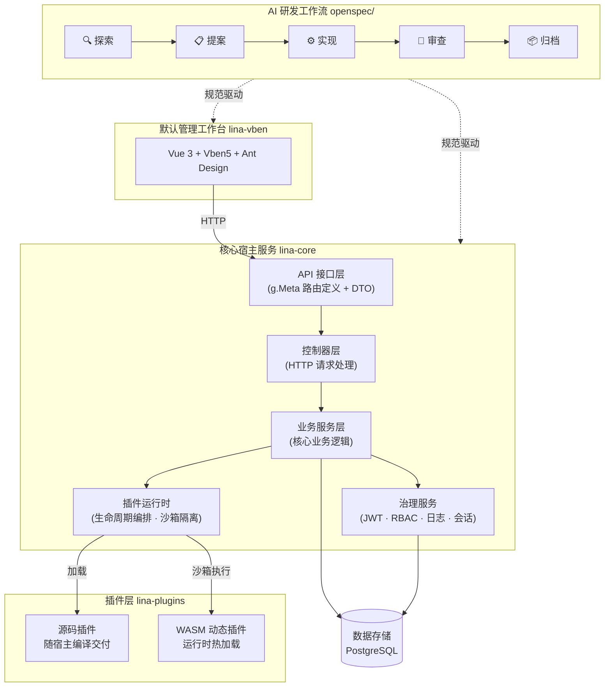

<div align=center>


[](https://github.com/linaproai/linapro/actions/workflows/main-ci.yml)
[](https://github.com/linaproai/linapro/releases)
[](https://github.com/linaproai/linapro)
[](https://github.com/linaproai/linapro)

[English](README.md) | 简体中文

</div>

# 项目介绍

`LinaPro`是一款**面向可持续交付的`AI`原生全栈框架**，将规范驱动的`AI`研发工作流、全生命周期`AI`技能体系、完整插件运行时与前后端一体化全栈设计融为一体，并内置权限管理、系统配置、任务调度等企业级基础能力，为团队构建起一套完整的`AI`原生交付底座。

团队无需从零搭建基础设施，从第一天起就能以`AI`作为主力驱动业务开发和持续交付。


# 快速链接

| 资源 | 地址 |
|------|------|
| **开源仓库** | https://github.com/linaproai/linapro |
| **后台演示** | http://demo.linapro.ai/ <br/>账号：`admin` <br/>密码：`admin123`|
| **官方网站** | https://linapro.ai/ |

# 项目定位

`LinaPro`面向独立开发者、研发团队和企业，提供以下核心能力：

- **AI 原生研发工作流**：内置`OpenSpec`规范驱动工作流，让`AI`主导分析、设计与实现，每次变更均锚定在增量规范与强制`E2E`测试上，团队专注于方向决策
- **丰富的 AI 技能体系**：内置十余项覆盖研发全生命周期的专属`AI`技能，涵盖后端开发、前端设计、测试编写、代码审查、性能审计、版本升级等场景，让`AI`在每个具体工作环节都能做出符合框架约束的专业决策
- **快速业务开发**：开箱即用的管理工作台与丰富的内置模块，显著缩短项目从零到上线的时间
- **全栈一体化**：前后端统一设计，接口契约、权限模型与设计规范完全对齐，无需独立集成两套框架
- **完整 API 文档**：自动聚合宿主与所有插件接口，支持在线浏览与调试
- **插件生态**：双模式插件系统（源码插件 +`WASM`动态插件），任意能力均可通过插件扩展或替换
- **企业级治理**：`JWT`认证配合声明式`RBAC`权限体系，内置操作日志、登录日志、会话管理等审计能力
- **原生分布式**：底层支持分布式锁、键值缓存、水平扩展，无需额外改造即可应对业务规模增长

# 技术架构



# 核心功能

## AI 原生研发工作流

`LinaPro`内置`OpenSpec`规范驱动工作流，覆盖从需求到交付的完整闭环：

- 探索 → 提案 → 实现 → 审查 → 归档，每次迭代经历完整的五阶段闭环
- 每次变更均锚定在增量规范文件与强制`E2E`测试上，防止架构漂移和测试空洞
- `AI`始终基于已验证的基础向前推进，而不是凭空生成代码
- 开发者扮演方向引导者与关键决策者，需求分析、设计、实现与测试由`AI`在规范约束下完成

## 丰富的 AI 技能体系

`LinaPro`内置十余项覆盖研发全生命周期的`AI`专属技能，涵盖后端开发、前端设计、测试保障、代码审查、性能审计、版本管理等场景。这些技能以领域知识的形式内嵌于框架的`AI`协作规范中，无需额外安装，`AI`工具在处理对应场景时会自动激活，让`AI`在每个具体工作环节都能做出符合框架约束的专业决策，而无需在每次对话中重复向`AI`解释项目规范。


## 宿主与工作台解耦设计

- 核心宿主服务（`lina-core`）是纯后端运行时，与任何前端实现完全解耦
- 默认管理工作台（`lina-vben`）是宿主能力的参考`UI`实现，可被替换为任意前端，包括移动端、小程序或自定义管理系统
- 宿主通过稳定的`RESTful API`契约对外暴露全部能力，接口定义与前端无关
- 支持多套前端同时接入同一套宿主服务，满足不同场景的界面需求

## 核心宿主服务

`lina-core`是整个框架的稳定基础，基于`GoFrame`构建，提供：

- **API 契约层**：完整的`RESTful API`接口定义，覆盖系统管理、插件治理和共享平台能力
- **业务服务层**：认证、权限、用户、角色、菜单、字典、配置、文件等核心服务的统一实现
- **插件运行时**：加载源码插件和`WASM`动态插件，协调其完整生命周期，提供稳定的扩展接缝
- **治理能力**：内置`JWT`认证、声明式`RBAC`权限、操作审计、会话管理等企业级治理能力
- **任务调度**：内置`Cron`定时任务子系统，支持任务分组、执行记录和异常追踪
- **基础设施**：分布式锁、键值缓存、`i18n`国际化、数据库迁移等底层能力

## 双模式插件系统

插件是`LinaPro`最主要的扩展点，每个插件是一个自包含的模块包：

- **源码插件**：编译期与宿主一同打包部署，适合长期维护的核心业务模块，性能无损耗
- **`WASM`动态插件**：运行时热加载，支持在线安装、启用、禁用与卸载，全程无需重启宿主
- 插件运行在独立隔离的沙箱，数据库与文件访问均通过命名空间隔离，插件间互不干扰
- 每个插件可独立声明`API`路由、业务逻辑、数据库表结构、前端页面与菜单，自包含零侵入

## 企业级安全认证

- `JWT`认证配合声明式`RBAC`权限体系，权限通过`API`定义层的标签声明，天然可见可审计
- 权限粒度细至按钮级别，支持菜单、页面、操作三级精细控制
- 权限拓扑变更快速生效，单机即时、集群最长不超过3秒，无需重启服务
- 会话管理支持强制下线
- 登录日志完整记录`IP`地址、设备信息与登录结果

## 默认管理工作台

`lina-vben`是框架内置的功能完整的管理工作台，开发者可直接在此基础上构建业务应用：


## 原生分布式架构

- 支持单机或分布式集群两种部署模式，水平扩展无需改造业务代码
- 底层内置支持分布式锁与键值缓存机制，核心组件支持集群自动感知
- 定时任务调度子系统具备分布式感知能力，集群环境下自动避免重复执行

## 多租户基础能力

`LinaPro`正在扩展基于`Pool`模型的多租户能力，同时保留默认单租户开箱体验。未安装或未启用`multi-tenant`插件时，宿主与插件数据统一使用`tenant_id = 0`，表示`PLATFORM`平台租户。

启用`multi-tenant`插件后：

- 租户身份通过内置责任链解析：`override`、`jwt`、`session`、`header`、`subdomain`和`default`；支持的运行时策略变更由插件持久化，不再通过宿主配置模板维护。
- 隔离模型由代码默认值维护，当前固定为`pool`。
- 用户与租户基数由代码默认值维护，默认`multi`，允许一个用户加入多个租户。
- 插件需要在`plugin.yaml`中声明`scope_nature`、`supports_multi_tenant`和`default_install_mode`；新租户自动启用策略由平台插件注册表维护，不由清单声明。
- `platform_only`插件按平台全局治理，`tenant_aware`插件可选择全局启用或按租户独立启用。
- `LifecycleGuard`钩子可否决插件禁用或卸载，`plugin.allowForceUninstall`控制平台管理员是否允许执行带审计的强制覆盖。

典型内部`BU`场景使用内置`multi`基数、`prompt`歧义处理，并对审计或内容类插件采用租户级启用。当前迭代仅支持`Pool`模型；`rootDomain`预留给后续设置入口，当前暂不支持配置。schema-per-tenant、database-per-tenant、配额、计费与品牌定制留作后续演进。


# 主要技术栈

| 类别 | 技术 | 说明 |
|------|------|------|
| 后端语言 | `Go` | `v1.25.0` |
| 后端框架 | `GoFrame` | `v2.10.1`，提供路由、`ORM`、配置等全套能力 |
| 前端框架 | `Vue 3` | 基于`Vben 5`管理台模板 |
| 前端 UI | `Ant Design Vue` | 企业级 `UI` 组件库 |
| 构建工具 | `Vite` | 极速前端构建 |
| 数据库 | `PostgreSQL` / 可选 `SQLite` | `PostgreSQL 14+`为默认数据存储；`SQLite`可用于本地演示或冒烟验证，仅支持单节点，不适用于生产 |
| 插件运行时 | `WebAssembly` | `tetratelabs/wazero`，支持`WASM`动态插件 |

## 快速开始

`LinaPro`默认使用`PostgreSQL`作为数据库。运行`make init`或`make dev`之前，请先准备`PostgreSQL 14+`实例；这些命令不会启动或管理数据库。

本地开发可使用以下容器：

```bash
docker run --name linapro-postgres \
  -e POSTGRES_USER=postgres \
  -e POSTGRES_PASSWORD=postgres \
  -e POSTGRES_DB=linapro \
  -p 5432:5432 \
  --health-cmd pg_isready \
  --health-interval 10s \
  --health-timeout 5s \
  --health-retries 5 \
  -d postgres:14-alpine
```

如果本机`5432`端口已被占用，可以将容器映射到其他本机端口，
例如`15432:5432`，并同步将`database.default.link`中的端口改为该本机端口。

先安装一次前端依赖，然后初始化并启动项目：

```bash
corepack enable
cd apps/lina-vben
pnpm install
cd ../..
go run ./hack/tools/linactl init confirm=init
go run ./hack/tools/linactl mock confirm=mock
go run ./hack/tools/linactl dev
```

`Linux`和`macOS`用户可以继续使用兼容`Makefile`入口：

```bash
make init confirm=init
make mock confirm=mock
make dev
```

`Windows`用户可以使用上面的跨平台`Go`入口。仓库根目录也提供`cmd.exe`薄包装入口`make.cmd`；在`cmd.exe`中会按可执行文件扩展名查找当前目录脚本，因此可直接省略`.cmd`后缀使用`make`：

```cmd
make init confirm=init
make mock confirm=mock
make dev
```

在`PowerShell`中，需要使用当前目录前缀调用；默认`Windows`环境下也可以省略`.cmd`后缀写成`.\make`。如需避免与本机已安装的其他`make`命令混淆，可使用`.\make.cmd`：

```powershell
.\make init confirm=init
.\make mock confirm=mock
.\make dev
```

默认后端连接为：

```yaml
database:
  default:
    link: "pgsql:postgres:postgres@tcp(127.0.0.1:5432)/linapro?sslmode=disable"
```

`linactl init`和`make init`是运维初始化命令，会直接使用配置中的数据库账号。该账号必须具备连接系统库、创建和删除目标数据库、终止目标库连接、建表、建索引、写入注释和写入`Seed`数据的权限。权限不足时初始化会失败，不会降级到低权限运行时模式。

使用外部托管`PostgreSQL`，例如`RDS`或阿里云`PolarDB`时，请将`database.default.link`指向供应商提供的主机和端口。执行`linactl init`或`make init`时使用具备上述权限的初始化账号；如果部署流程需要运行时低权限账号，请在初始化完成后再替换运行配置。

如需单节点开发演示，可切换为`SQLite`链接：

```yaml
database:
  default:
    link: "sqlite::@file(./temp/sqlite/linapro.db)"
```

`SQLite`模式仅用于本地演示和冒烟验证，不属于生产部署模式。
