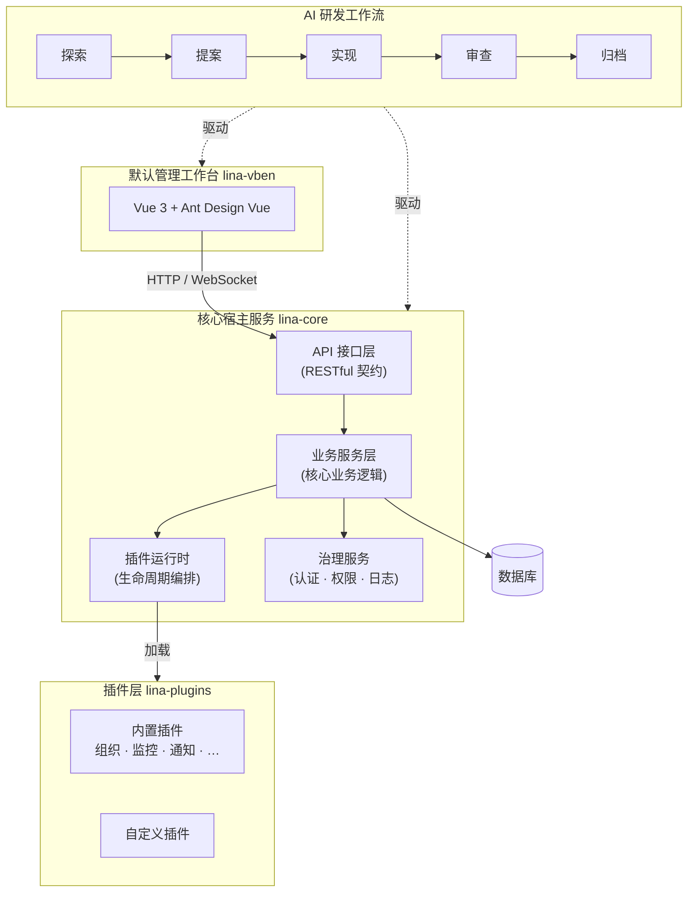

# LinaPro

`LinaPro`是一个`面向可持续交付的 AI 原生全栈框架`，把 `AI` 作为核心生产力：`AI` 主导分析、设计与实现，团队把握方向与关键决策。框架自带核心宿主服务、管理工作台、插件运行时与规范驱动的 `AI` 原生研发工作流，帮助团队快速交付生产级应用，同时保持架构、测试与治理的可持续演进。


## `LinaPro`是什么

`LinaPro`包含四个紧密协作的层次：通用核心宿主服务、开箱即用的管理工作台、双模式插件运行时扩展机制，以及规范驱动的`AI`原生研发工作流。每一层均遵循松耦合原则独立设计，业务模块可按需启用或禁用，确保产品在`AI`增益的时代背景下能够持续迭代与交付。

| 层次 | 模块 | 描述 |
|------|------|------|
| 核心宿主服务 | `lina-core` | 通用后端运行时——`API`契约、服务治理、认证鉴权、权限管理、插件生命周期等通用能力 |
| 默认管理工作台 | `lina-vben` | 提供通用的、基于`Vue 3`开箱即用的前端工作台，也是所有内置能力的参考`UI`实现 |
| 可插拔插件系统 | `lina-plugins` | 可热加载的插件（源码插件与动态插件），无需修改宿主即可扩展或覆盖任意核心能力 |
| `AI`研发工作流 | `openspec/` | 规范驱动的结构化工作流，让`AI`、人类与代码库在每次迭代中保持对齐 |

### 核心优势

- **`AI`原生研发工作流。** 每次迭代遵循探索→提案→实现→审查→归档闭环，变更锚定在增量规范文件和强制`E2E`测试上，`AI`始终基于已验证基础向前推进，从根本上防止架构漂移和测试空洞。

- **前后端一体化全栈设计。** 框架同时提供生产就绪的后端运行时（`lina-core`）与前端管理工作台（`lina-vben`），两者在接口契约、权限模型与设计规范上完全对齐，开发者无需自行集成两套独立框架即可交付完整产品。

- **开箱即用的内置能力。** 内置覆盖完整业务场景的核心服务、多个生产就绪官方插件，以及丰富的管理功能模块，新项目无需从零搭建即可直接投入业务开发。

- **模块级松耦合设计。** 所有业务模块均遵循松耦合原则独立设计，模块间通过接口而非硬依赖协作，支持按需启用或禁用，具备极强的可组合性与可替换性。

- **无与伦比的可扩展性。** 框架提供双模式可插拔插件运行时（编译期源码插件与运行时`WASM`动态插件），插件运行在隔离沙箱中，数据库与文件访问均通过命名空间隔离，共享覆盖核心生命周期的完整扩展点体系，任意能力均可通过插件扩展或替换，无需修改宿主代码。

- **企业级治理开箱即用。** `JWT`认证配合声明式`RBAC`权限体系——权限通过`API`定义层的标签声明，天然可见可审计；权限拓扑毫秒级生效，操作日志自动脱敏，会话管理支持强制下线，登录审计记录完整`IP`和设备指纹。

- **原生分布式架构设计。** 框架底层支持单机或分布式部署，天然具备水平扩展能力，权限拓扑版本同步、分布式锁、键值缓存等核心组件均支持集群感知能力，无需额外改造即可应对业务规模增长。


## 开箱即用的管理工作台

`LinaPro`内置了功能完整的默认管理工作台（`lina-vben`），覆盖企业应用开发中最常见的基础业务场景。开发者无需从零搭建，可直接在此基础上构建业务应用，也可以通过插件机制按需扩展或替换任意模块。

**权限管理**

| 模块 | 功能描述 |
|------|---------|
| 用户管理 | 用户`CRUD`、角色分配、密码重置、状态管理、批量导出 |
| 角色管理 | 角色定义、菜单权限分配、按钮级权限授权 |
| 菜单管理 | 动态菜单树配置，支持目录、菜单、按钮三级结构 |

**系统设置**

| 模块 | 功能描述 |
|------|---------|
| 字典管理 | 字典类型与字典数据的统一维护，支持导入导出 |
| 参数设置 | 运行时参数维护，支持配置导入导出 |
| 文件管理 | 文件上传、下载与存储管理 |

**任务调度**

| 模块 | 功能描述 |
|------|---------|
| 任务管理 | `Cron`表达式配置、立即执行、暂停恢复、执行历史 |
| 分组管理 | 任务按业务域分组管理 |
| 执行日志 | 执行记录查询、异常日志查看 |

**扩展中心**

| 模块 | 功能描述 |
|------|---------|
| 插件管理 | 插件安装、启用、禁用、卸载与版本管理 |

**开发中心**

| 模块 | 功能描述 |
|------|---------|
| 接口文档 | 在线`API`文档浏览与调试 |
| 系统信息 | 运行时环境信息查看 |

以下模块由官方插件提供，安装对应插件后自动注入菜单与路由，无需额外配置：

| 插件 | 菜单模块 | 功能描述 |
|------|---------|---------|
| `org-center` | 部门管理、岗位管理 | 组织架构树形维护及岗位定义 |
| `content-notice` | 内容管理-通知公告 | 公告内容`CRUD`，支持多种公告类型 |
| `monitor-online` | 系统监控-在线用户 | 在线会话实时查看、强制下线 |
| `monitor-server` | 系统监控-服务监控 | 服务器`CPU`、内存、磁盘及运行时信息采集展示 |
| `monitor-operlog` | 系统监控-操作日志 | 用户操作记录审计，含请求参数、耗时与操作结果 |
| `monitor-loginlog` | 系统监控-登录日志 | 登录记录查询，含`IP`地址、设备信息与登录结果 |

所有模块均已与后端`RBAC`权限体系完整集成——角色分配决定菜单可见性与按钮级操作权限，权限变更实时生效无需重新登录。

## 架构设计

以下架构图展示了四个层次在运行时的交互关系：



**架构设计原则：**

- `AI`研发工作流凌驾于所有层次之上——它是让规范、代码与测试保持同步的连接纽带。
- `lina-core`是稳定的地基；它不了解具体的`UI`布局或业务领域，只提供稳定的通用能力。
- 插件通过定义良好的接口扩展`lina-core`，永远不修改宿主内部实现。
- 默认管理工作台是`lina-core`的一个消费者，而非其定义本身。

## 仓库结构

```text
apps/
  lina-core/      核心宿主服务（Go）
  lina-vben/      默认管理工作台（Vue3 + Vben5）
  lina-plugins/   内置插件与插件开发样例
hack/
  scripts/install/ 快速安装脚本（`macOS`、`Linux`、`Windows`）
  tests/          Playwright E2E 测试集
openspec/
  changes/        活跃与已归档的变更记录
  specs/          当前生效的能力基线规范
```

## 快速开始

### 环境要求

- Go 1.22+
- Node.js 20+
- pnpm 8+
- MySQL 8.0+

### 快速安装

| 平台 | 推荐命令 |
|------|---------|
| `macOS` / `Linux` | `curl -fsSL https://linapro.ai/install.sh \| bash` |
| `Windows Git Bash 或 WSL` | `curl -fsSL https://linapro.ai/install.sh \| bash` |

仓库内对应的正式入口源码位于 `hack/scripts/install/bootstrap.sh`。
Windows 用户必须在 Git Bash 或 WSL 中执行安装命令；原生 PowerShell 不再作为安装入口维护。

- 默认会在当前工作目录下新建一个 `./linapro` 子目录并克隆源码。
- 未设置 `LINAPRO_VERSION` 时，安装器会解析 GitHub 最新稳定发布版本；如果无法解析标签，会明确失败。
- 使用 `LINAPRO_DIR=/path/to/app` 可以安装到指定目录。
- 使用 `LINAPRO_SKIP_MOCK=1` 可以在数据库初始化后跳过演示/`mock`数据。
- 只有在带宽受限时才建议使用 `LINAPRO_SHALLOW=1`；后续第一次升级需要先执行 `git fetch --unshallow`。
- 安装器会执行依赖检查、后端/前端依赖安装、`make init confirm=init`，并在未跳过时执行 `make mock confirm=mock`。

本地执行示例：

```bash
bash ./hack/scripts/install/bootstrap.sh
LINAPRO_VERSION=v0.5.0 LINAPRO_DIR=~/Workspace/linapro bash ./hack/scripts/install/bootstrap.sh
```

### 启动步骤

```bash
# 1. 初始化数据库
make init confirm=init

# 2. 加载演示数据（可选）
make mock confirm=mock

# 3. 启动前后端服务
make dev
```

默认管理工作台访问地址：`http://localhost:5666`。
后端`API`服务访问地址：`http://localhost:8080`。

### 其他常用命令

```bash
make stop         # 停止所有本地服务
make status       # 查看服务运行状态
make test-install # 运行安装脚本 smoke test
make test         # 运行完整 E2E 测试套件
```

### 升级

框架升级与源码插件升级统一通过 `.claude/skills/lina-upgrade/` 下的 `lina-upgrade` AI 技能驱动。
可以直接让 AI 工具执行目标范围，例如 `upgrade LinaPro framework to v0.6.0`、`upgrade source plugin plugin-demo-source` 或 `upgrade all source plugins`。

## 默认账号

| 字段 | 值 |
|------|-----|
| 用户名 | `admin` |
| 密码 | `admin123` |

## 插件开发

插件是`LinaPro`中最主要的扩展点。每个插件是一个自包含的模块包，可声明独立的`API`路由、服务逻辑、数据库表结构、前端页面和菜单项。宿主在运行时热加载和卸载插件，无需停机。

详见`apps/lina-plugins/README.md`，其中包含从零开始构建和注册插件的完整指南。

## 文档与入口索引

| 资源 | 描述 |
|------|------|
| `CLAUDE.md` | 仓库级工程规则、编码规范与工作流说明 |
| `apps/lina-core/README.md` | 核心宿主服务架构与扩展契约 |
| `apps/lina-vben/README.md` | 前端工作台搭建与开发指南 |
| `apps/lina-plugins/README.md` | 插件系统总览与插件开发参考 |
| `openspec/specs/` | 当前生效的能力基线规范 |
